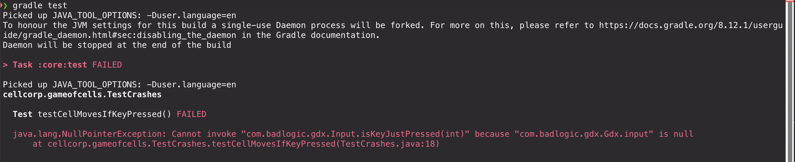

# Testing -- Problems and Solutions

Testing LibGDX games presents some problems. Most notably, tests often crash with NullPointerExceptions.

## Problem 1 -- Can't access private fields in tests

Say we've made a little `Cell` class, which moves to the right at 2 units/second.
Nobody else needs to know the X or Y positions, so we make them private.

We want to test that after 1 second, it's moved 2 units.


We make the cell, and move it, but we can't access `xPos`!

## Options

- We could refuse to inspect private fields.
    But how do we know that `update()` works correctly?
- We could add a `getXPos()` method.
    But now everyone can read this private field.
- We could add `getXPosTestOnly()`, and promise not to use it outside test methods.

We plan to add public getters when needed for testing.
While these expose internal fields, they are at least read-only (for primitive fields...)

# Problem 2 -- Graphics methods crash tests!


Now we can check the X position.
We run the test, to make sure it works, and...


"`com.badlogic.gdx.Gdx.gl` is null."

LibGDX doesn't load up the graphics classes when
we run JUnit tests, so if any graphics methods are called,
the tests just crash.

## Solution -- public update() method

There's multiple solutions here.
We could make a `CellDrawer` object, and give the cell
a fake version during tests.
But I think the simplest thing is to separate the
update logic and the drawing within the `Cell` class.

Instead of calling `render()` in the test,
we make `update()` public, and call it.

For this to work, we need to make sure that we never
call `ScreenUtils` or `Gdx.anything` methods in our update code.
We also can't reference any assets (images, fonts, etc.) outside of draw code.


# Problem 3 -- Testing input handling

We've updated `Cell` so it only moves while the
right arrow key is pressed. Let's test it.


Two problems:
- We don't have a way to say that a key is held down,
    so the cell won't actually move.
- We're using `Gdx.input`, so when we run the test, it _also_ crashes!



## Solution -- Input provider

Ok, I don't know what this should be called.
It's just an interface that copies methods we need from the `Input` class.

We make a default implementation, that just uses `Gdx.input.whatever`,
and a fake test implementation, that lets us pretend certain keys are held down.


Now we can give `Cell` the default input provider in game code,
and give it the fake input provider in test code.


And the test passes!

We plan to use this solution for input handling.

# Problem 4 -- Constructing a class crashes

We test that we can create a Cell without crashing:


It crashes!


Why? Because we create a new `Texture` in the `Cell` constructor.

But LibGDX hates us, so we can't access `Gdx.files` in unit tests!

## Solution -- AssetManager

Use an `AssetManager`:

https://libgdx.com/wiki/managing-your-assets

If all loading of assets goes through the `AssetManager`, 
and we only _use_ the assets in draw code,
we can just mock the manager to do nothing in the test code,
and solve our crashes


Now update our test to mock the asset manager


And everything works. The game still runs and draws the cell,
and the test doesn't crash.


# Note -- Testing Game and Screen classes

The LibGDX-provided implementations of `Game` and `Screen` don't play nice
with JUnit.

If we want to test these classes, it's possible, but we'll have to do a little
re-writing of the classes. It's not that hard, but we don't need to do it right now.

Setting it up would let us do stuff like:
```java
// Set up a `Game` instance we can control
var testGame = new TestGame();

// When we press space, it should start the game.
harness.setHeldDownKeys(Set.of(Input.Keys.SPACE));
harness.runForSeconds(2);

assert (harness.game.currentScreen instanceof GameScreen);
```
%%%%%%% Changes from base to side #2
+# Testing -- Problems and Solutions
+
+Testing LibGDX games presents some problems. Most notably, tests often crash with NullPointerExceptions.
+
+## Problem 1 -- Can't access private fields in tests
+
+Say we've made a little `Cell` class, which moves to the right at 2 units/second.
+Nobody else needs to know the X or Y positions, so we make them private.
+
+We want to test that after 1 second, it's moved 2 units.
+
+
+
+We make the cell, and move it, but we can't access `xPos`!
+
+## Options
+
+- We could refuse to inspect private fields.
+    But how do we know that `update()` works correctly?
+- We could add a `getXPos()` method.
+    But now everyone can read this private field.
+- We could add `getXPosTestOnly()`, and promise not to use it outside test methods.
+
+We plan to add public getters when needed for testing.
+While these expose internal fields, they are at least read-only (for primitive fields...)
+
+# Problem 2 -- Graphics methods crash tests!
+
+
+
+Now we can check the X position.
+We run the test, to make sure it works, and...
+
+
+
+"`com.badlogic.gdx.Gdx.gl` is null."
+
+LibGDX doesn't load up the graphics classes when
+we run JUnit tests, so if any graphics methods are called,
+the tests just crash.
+
+## Solution -- public update() method
+
+There's multiple solutions here.
+We could make a `CellDrawer` object, and give the cell
+a fake version during tests.
+But I think the simplest thing is to separate the
+update logic and the drawing within the `Cell` class.
+
+Instead of calling `render()` in the test,
+we make `update()` public, and call it.
+
+For this to work, we need to make sure that we never
+call `ScreenUtils` or `Gdx.anything` methods in our update code.
+We also can't reference any assets (images, fonts, etc.) outside of draw code.
+
+
+
+# Problem 3 -- Testing input handling
+
+We've updated `Cell` so it only moves while the
+right arrow key is pressed. Let's test it.
+
+
+
+Two problems:
+- We don't have a way to say that a key is held down,
+    so the cell won't actually move.
+- We're using `Gdx.input`, so when we run the test, it _also_ crashes!
+
+
+
+## Solution -- Input provider
+
+Ok, I don't know what this should be called.
+It's just an interface that copies methods we need from the `Input` class.
+
+We make a default implementation, that just uses `Gdx.input.whatever`,
+and a fake test implementation, that lets us pretend certain keys are held down.
+
+
+
+Now we can give `Cell` the default input provider in game code,
+and give it the fake input provider in test code.
+
+
+
+And the test passes!
+
+We plan to use this solution for input handling.
+
+# Note -- Testing Game and Screen classes
+
+The LibGDX-provided implementations of `Game` and `Screen` don't play nice
+with JUnit.
+
+If we want to test these classes, it's possible, but we'll have to do a little
+re-writing of the classes. It's not that hard, but we don't need to do it right now.
+
+Setting it up would let us do stuff like:
+```java
+// Set up a `Game` instance we can control
+var testGame = new TestGame();
+
+// When we press space, it should start the game.
+harness.setHeldDownKeys(Set.of(Input.Keys.SPACE));
+harness.runForSeconds(2);
+
+assert (harness.game.currentScreen instanceof GameScreen);
+```
